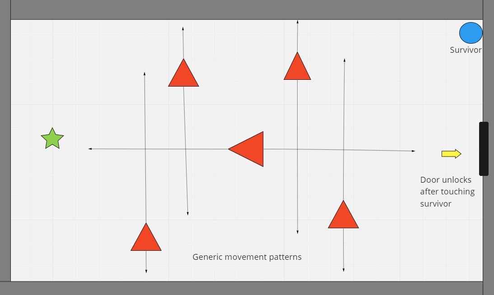

# Dungeon-Diver

Delve deep into the dungeons! ...why? To save the survivors of the last party that went down there...what? Is that not enough for you? Okay fine there is also more treasure than your arms can carry. Oh...you'll go now? Okay adventurer get down there, slay those goblins, save the survivors and get some riches!

---

## Tech Stack

- HTML
- CSS
- Javascript
- Canvas

---

## Wireframe

---

## MVP Goals

- Create starting screen inside the Game Boy screen area
- Make a dungeon room the adventurer starts in and render him in there
- Make sure he can't walk through walls
- Make enemies that move in a designated pattern
- Make the adventurer have an attack animation(ex. a sword stab or arrow)
- Give the adventurer 3 health points total
- Make the enemies shoot arrows that take 1 health off everytime the adventurer is hit
- Make a survivor against the back wall you must touch and tell the way out is clear
- Make the survivor de-render after saving him (touching his hitbox)
- Make doors in the dungon wall that take you to the next room
- Create a treasure pile to win but there is a twist
- Make a final boss render after touching the treasure
- Once dead the game will display a message congragulating the adventurers and ending the game

---

## Stretch Goals

1. Add different monster types
2. Give the final boss different attack patterns
3. Add a High-Score counter
4. Add traps, like spikes shooting out of the walls
5. Add different weapons or attacks for the adventurer
6. Make more rooms or a second level entirely
7. Make enemies move toward the adventurer
8. Have the adventurer and monsters be pushed back when hit
9. Set respawn point every 2 rooms
10. Create more than one room

---

## Potential Roadblocks

- making sure the models I put on the objects match the hit-boxes correctly
- setting up the sword stabbing forward animation
- making the second room load after hitting the door
- how to set the spawns along the way

---

## Art Credit

- Doors: https://opengameart.org/content/lpc-animated-doors
- Chest: Twitter@pixelpooper
- Bats: https://www.gamedevmarket.net/member/elthens-pixel-art-shop/
- Arrow: https://www.kindpng.com/imgv/Txoxmib_pixel-arrow-png-picture-arrow-pixel-png-transparent/
- Boss Mob: https://opengameart.org/content/bosses-and-monsters-spritesheets-ars-notoria
- Heart: https://opengameart.org/content/heart-pixel-art
- Player Character and Key: Legend of Zelda a Link to the Past
- Bebo the True Hero of the Story: https://craftpix.net/freebies/free-pixel-art-tiny-hero-sprites/
- Goblins: https://opengameart.org/content/lpc-goblin
